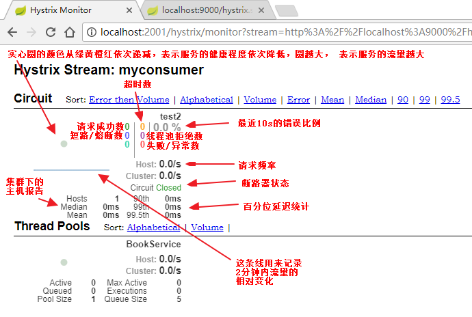

### 描述

##### 解决问题
  * 多节点服务 hystrix 仪表盘聚集图形展示
  
  
  
  * 多服务聚集 hystrix 仪表盘合并图形展示
  
  
  
  * 仪表盘说明
  
  

-----

##### 使用要求

* 在公司统一注册中心中的微服务。

* 接入了Hystrix 组件。

* Hystrix 端口可以访问。

##### 使用说明
* 指定服务名称 规则为：turbine_项目 名称

* 上传服务配置文件到配置中心 配置示例：http://10.10.7.60:20080/zygfengyuwuzu/config-dev/blob/master/turbine-1.yml

* 设置 app-config 为要被聚集的服务名称，多个用 逗号 分割。

* 每个项目部署一个聚合仪表盘，收集整个项目的服务请求信息。

* 打开Hystrix 仪表盘地址 http://servicemoniter.zjs.com.cn/hystrix

* 输入 部署完毕的聚合服务 http://turbine-hostname:port/turbine.stream

##### 问题说明
		1. 聚合监控问题
		
			i. 由于如果聚合全部注册中心的服务，会对带宽照成不小的压力，每秒可到 几十M。
			ii. 大数据、长时间的流量会集中到一个路由器上，会影响这个路由器的带宽。
			iii. 由于是聚合所有服务，在现有的仪表盘上展示效果非常凌乱，尤其是API方法名称重复的情况下，非常不容易定位到具体哪个服务。
		
		2. 聚合监控问题的解决方案
		
			i. 以项目为核心，该项目的所有服务建立单独的 聚合服务。
			ii.部署服务的时候需要注意，劲量部署在于项目服务同一个服务网络中。
		        

